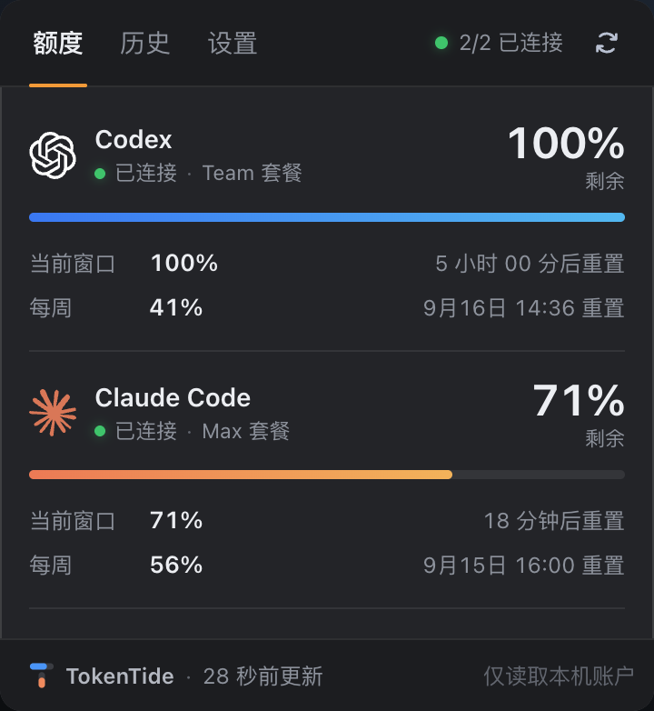
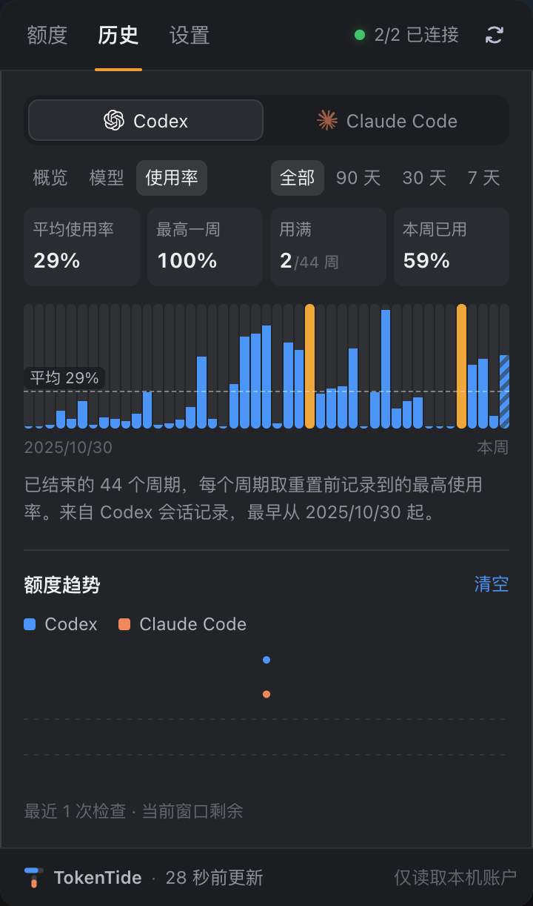

# TokenTide

English | [简体中文](README.zh-CN.md)

TokenTide is a macOS menu-bar widget that shows how much of your **Codex** and **Claude Code** quota is left, how much of each weekly quota you actually use, and your usage history. Everything is read locally from the command-line tools you are already signed in to: no account, no API key, and nothing leaves your Mac. The interface is in Chinese.

**[⬇ Download the latest version (TokenTide.zip)](https://github.com/redbson/TokenTide/releases/latest/download/TokenTide.zip)** · [All releases](https://github.com/redbson/TokenTide/releases)

<p>
  
  
</p>

## Features

- **Menu-bar readout**: two small lines, `CX` / `CC`, with the remaining percentage of the current Codex and Claude Code window.
- **Quota tab (额度)**: current-window and weekly quota left for both tools, with reset countdowns; a notice when a window drops below 20%; refreshes every 5 minutes, and again when you open the panel if the data is more than a minute old.
- **History · overview / models (概览 / 模型)**: sessions, messages, tokens, active days, streaks, peak hour, and favorite model, modeled on Claude Code's `/stats`, plus a 26-week heatmap.
- **History · utilization (使用率)**: how much of each weekly quota you actually used — average, highest week, weeks that hit the limit, this week so far — with a bar per week, over the last 7, 30, or 90 days or all time.
- **Quota trend (额度趋势)**: the current-window remaining quota across recent checks.
- **Settings tab (设置)**: launch at login, automatic updates, auto-refresh, and the low-quota notice.
- **Automatic updates**: when a new release is published, TokenTide downloads, verifies, and installs it by itself.

## Requirements

- macOS 13 or later (developed and tested on macOS 26), Apple silicon or Intel
- [Node.js](https://nodejs.org/) 20 or later (TokenTide's local service runs on Node)
- [Codex CLI](https://github.com/openai/codex) (`codex`) and/or [Claude Code](https://docs.anthropic.com/en/docs/claude-code) (`claude`), installed and signed in. Claude Code must be signed in with a claude.ai subscription (Pro / Max); API-key accounts have no plan quota to read. One of the two is enough; the other shows as unavailable (不可用).

## Installation

### Download (recommended)

1. Download [TokenTide.zip](https://github.com/redbson/TokenTide/releases/latest/download/TokenTide.zip) (or pick a version on [Releases](https://github.com/redbson/TokenTide/releases)), unzip it, and drag `TokenTide.app` into Applications.
2. First launch: TokenTide is not notarized by Apple, so macOS says it cannot verify the developer. Open System Settings → Privacy & Security and click **Open Anyway** near the bottom, or run:

   ```bash
   xattr -dr com.apple.quarantine /Applications/TokenTide.app
   ```

3. Later versions are downloaded and installed by TokenTide itself (see [Automatic updates](#automatic-updates)), so you won't see this prompt again.

To start TokenTide when you log in, turn on 开机时启动 (launch at login) in the panel's 设置 tab. If macOS asks for approval, click 打开「登录项」设置 and allow TokenTide in System Settings.

### Build from source

Requires the Xcode Command Line Tools (`xcode-select --install`).

```bash
git clone https://github.com/redbson/TokenTide.git
cd TokenTide
npm install
npm run build:mac
ditto release/TokenTide.app /Applications/TokenTide.app
open /Applications/TokenTide.app
```

The built app contains its own interface and local service, so you can move or delete the project folder afterwards.

## Automatic updates

- TokenTide checks the latest GitHub release shortly after it starts and every 6 hours after that.
- When there is a newer version, it downloads the zip and checks the SHA-256 checksum, bundle identifier, version, and code signature. Only if all of them match does it replace `TokenTide.app` and relaunch. It never installs while the panel is open; it waits until you close it.
- In 设置 → 更新 you can turn automatic updates off (you'll still be told about new versions), check now (检查更新), or install right away (立即更新).
- If TokenTide sits somewhere you can't write to, it can't replace itself and asks you to download the update manually.

## Usage

- **Left-click** the menu-bar readout to open the panel; click anywhere else or press Esc to close it.
- **Right-click** for 显示额度 (show quota), 立即刷新 (refresh now), and 退出 (quit). The panel footer also has 退出.
- **额度 (Quota)**: quota left and reset times for both tools; the button at the top right refreshes immediately.
- **历史 (History)**: switch between Codex and Claude Code at the top, then pick 概览 / 模型 / 使用率 (overview / models / utilization) and a range (全部 / 90 天 / 30 天 / 7 天).
- **设置 (Settings)**:
  - **开机时启动 (launch at login)**: shows TokenTide in the menu bar after you log in. It uses macOS Login Items, so you can also turn it off in System Settings → General → Login Items.
  - **自动更新 (automatic updates)**: see [Automatic updates](#automatic-updates).
  - **自动刷新 (auto-refresh)**: reads your quota every 5 minutes.
  - **低额度提醒 (low-quota notice)**: shows a notice in the panel when the current window drops below 20%.

### How utilization is calculated

- Each **weekly quota window** counts once: the highest usage recorded before that window reset.
- The average, highest week, and weeks that hit the limit only include windows that have **ended**. The week in progress is shown separately as 本周已用 (used this week) and drawn with stripes at the right end of the chart.
- **Codex** history comes from the quota snapshots in your local Codex session files, back to your earliest session.
- **Claude Code** keeps no quota history on your Mac, so TokenTide records it on every refresh. Weeks before that are **estimated** (hollow dashed bars, figures prefixed with "≈"):
  - Each reply's token usage in your local Claude Code transcripts is converted to its Anthropic API-price equivalent (pricier models and output weigh more; cache reads count at the much cheaper cache price).
  - The weeks TokenTide has recorded give a "percent of the weekly quota per dollar" factor, which is applied to earlier weeks, stepping back 7 days at a time from the recorded reset time.
  - The estimate only sees Claude Code usage on this Mac. Usage in claude.ai, the Claude app, or on other computers counts against the same weekly quota, so estimates **run low**; they get more accurate as more weeks are recorded. Claude Code keeps transcripts for about 30 days by default, so older weeks can't be estimated.
- If you switched accounts, each account's windows are counted separately.

## Data sources and privacy

| Data | Source |
|---|---|
| Codex quota | `account/rateLimits/read` from `codex app-server` |
| Claude Code quota | A short-lived `claude -p` process sends the structured `get_usage` request (the same source as `/usage`). No prompt is sent, so it uses no quota. The request is marked experimental upstream; if it fails, TokenTide falls back to reading the `/usage` screen |
| Usage history | Local transcripts: `~/.claude/projects/**/*.jsonl`, `~/.codex/sessions`, `~/.codex/archived_sessions` |
| Weekly utilization | Quota snapshots in Codex session files plus TokenTide's own records; earlier Claude Code weeks are estimated from local transcripts |

- From transcripts, TokenTide only counts messages, tokens, model names, and times. **It never reads or returns conversation content.**
- The local service listens on `127.0.0.1` only and rejects cross-origin requests. It never reads or records tokens, credentials, or account identifiers.
- When Claude Code fails to fetch fresh numbers from its server, it may report the last values it had.

Files TokenTide writes on your Mac:

| File | Purpose |
|---|---|
| `~/Library/Logs/TokenTide.log` | Local service log |
| `~/Library/Caches/TokenTide/usage-stats-v3.json` | Usage-history cache (only changed transcripts are re-read) |
| `~/Library/Application Support/TokenTide/quota-weeks.json` | Weekly quota records (the only source of Claude Code utilization history) |

## Troubleshooting

- **The panel says 无法启动本机额度服务 (can't start the local service)**: make sure Node.js 20 or later is installed and `node` can be found in `~/.local/bin`, `/opt/homebrew/bin`, `/usr/local/bin`, or your login shell's PATH. Details are in `~/Library/Logs/TokenTide.log`.
- **Port 4173 is taken**: TokenTide always uses port 4173. Quit whatever is using it first.
- **An automatic update failed**: 设置 → 更新 shows the reason. You can always download the latest version from [Releases](https://github.com/redbson/TokenTide/releases/latest) and install it over the old one; your settings and records are kept.
- **A tool shows 不可用 (unavailable)**: run `codex` or `claude` once in Terminal and make sure you're signed in.
- **Claude Code shows /usage 备用读取 (/usage fallback)**: the `get_usage` request failed and TokenTide read the `/usage` screen instead. The numbers are still valid.

## Development

```bash
npm run dev                          # open http://127.0.0.1:5173/ (with live data)
npm test                             # unit tests
npm run build                        # build the panel into dist/client
npm run build:mac                    # build release/TokenTide.app for this Mac's architecture
npm run build:mac -- --universal     # build a universal (Apple silicon + Intel) app
```

The Vite dev server uses port 5173, so it doesn't collide with an installed TokenTide (port 4173). In a normal browser the panel is centered on a dark backdrop; in the app it fills the dropdown.

### Publishing a release

1. Set `version` in `package.json` to the new version, then commit and push (optional; the release tag wins).
2. Publish a GitHub release tagged `vX.Y.Z`, or run:

   ```bash
   gh release create v0.3.1 --generate-notes
   ```

3. The [release workflow](.github/workflows/release.yml) runs the tests, builds the universal app, and attaches `TokenTide-X.Y.Z.zip`, its `.sha256` checksum, and an unversioned `TokenTide.zip` (used by the "download the latest version" link). Installed copies update themselves at their next check.
4. To rebuild an existing release, run the Release workflow manually from the Actions tab and enter its tag.

| Directory | Contents |
|---|---|
| `src/` | Panel UI (React) |
| `server/` | Local service: quota readers, transcript statistics, weekly quota records; `main.mjs` is the entry point bundled into the app |
| `macos/` | Menu-bar shell (Swift / AppKit + WKWebView) and automatic updates (`Updater.swift`) |
| `.github/workflows/` | Release packaging |
| `branding/`, `public/assets/` | Icons |
| `scripts/` | App packaging (`build-macos.mjs`) and icon generation |
| `tests/` | `node --test` tests |

## Disclaimer

TokenTide is an independent project and is not affiliated with OpenAI or Anthropic. Codex, OpenAI, Claude, Claude Code, and related marks are trademarks of their respective owners and are used only to identify the services being monitored.

## License

[Apache License 2.0](LICENSE)
